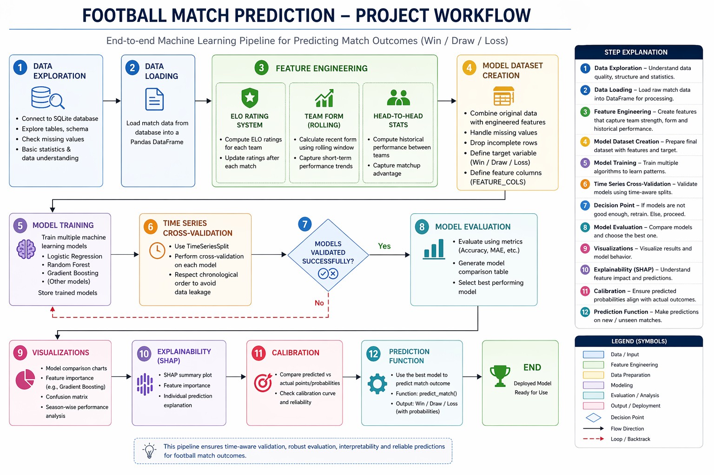

# ⚽ Football Match Outcome Prediction — Multi-League ML Framework

<div align="center">


**A production-grade machine learning framework for predicting football match outcomes across five major European leagues — combining ELO ratings, rolling form statistics, betting market signals, and SHAP explainability in a single anti-leakage pipeline.**

[Overview](#-overview) • [Features](#-features) • [Dataset](#-dataset) • [Architecture](#-architecture) • [Installation](#-installation) • [Usage](#-usage) • [Results](#-results) • [Explainability](#-shap-explainability) • [Contact](#-contact)

</div>

---

## 📌 Overview

**Football Match Outcome Prediction** is a research-grade, end-to-end ML framework built on the [European Soccer Database](https://www.kaggle.com/datasets/hugomathien/soccer). It predicts three-class match outcomes — **Win**, **Draw**, or **Loss** — for home teams across the **English Premier League, Spanish La Liga, German Bundesliga, Italian Serie A**, and **French Ligue 1**, spanning eight seasons (2008/09–2015/16).

The framework addresses key gaps in existing literature:
- ✅ **Multi-league generalization** — trained and evaluated across five leagues simultaneously
- ✅ **No data leakage** — three-layer anti-leakage architecture with temporal splits
- ✅ **ELO as a first-class ML feature** — not just a standalone baseline
- ✅ **Betting market integration** — normalized implied probabilities from three bookmakers
- ✅ **Full explainability** — SHAP analysis at both global and match-level granularity

---

## ✨ Features

### 🔧 Feature Engineering (33 Features)

| Signal Source | Features Generated |
|---|---|
| **Rolling Form (Last 3)** | Goals for/against, goal diff, wins, points — home & away + differentials |
| **Rolling Form (Last 5)** | Goals for/against, goal diff, wins — home & away + differentials |
| **Season Cumulative** | Long-term average points per team |
| **ELO Ratings** | `elo_home`, `elo_away`, `elo_diff`, `elo_home_win_prob` |
| **Head-to-Head** | Vectorized O(n) historical home win rate per matchup |
| **Betting Market** | Normalized implied probabilities: `odds_home_prob`, `odds_draw_prob`, `odds_away_prob` |

### 🤖 Machine Learning Models
- **Logistic Regression** — Multinomial with `solver=lbfgs`, balanced class weights
- **Random Forest** — 400 trees, `max_depth=8`, balanced class weights
- **Gradient Boosting** — 300 estimators, `learning_rate=0.05`, `subsample=0.8` *(best performer)*

### 🛡️ Anti-Leakage Architecture
- Rolling statistics computed with `shift(1)` — only past matches contribute
- ELO ratings computed and saved *before* each match result is known
- scikit-learn `Pipeline` + `TimeSeriesSplit` (5 folds) — prevents any future data from entering training

### 📊 Evaluation & Explainability
- Accuracy, Precision, Recall, F1-score per class
- Expected Points MAE: `|actual_pts − E[pts]|` where `E[pts] = 3·P(Win) + 1·P(Draw)`
- SHAP `PermutationExplainer` — global summary plots, feature importance bar charts, match-level waterfall plots

---

## 🗄️ Dataset

| Property | Details |
|---|---|
| **Source** | [European Soccer Database — Kaggle](https://www.kaggle.com/datasets/hugomathien/soccer) |
| **Format** | SQLite (7 relational tables) |
| **Matches** | 25,979 across 5 major leagues |
| **Seasons** | 2008/09 – 2015/16 (8 seasons) |
| **Players** | 11,060 with 183,978 attribute snapshots |
| **Teams** | 299 with tactical attributes |
| **Bookmakers** | Bet365, Betwin, Interwetten |

**Database Schema:**
```
Match (25,979 rows × 115 cols)
├── home/away team IDs, goals, match date, season, league
├── player lineup positions (X/Y coordinates)
└── betting odds: B365H/D/A, BWH/D/A, IWH/D/A, ...

Team_Attributes (1,458 rows × 25 cols)
├── buildUpPlaySpeed, buildUpPlayPassing
├── chanceCreationShooting, defencePressure
└── defenceAggression, defenceTeamWidth

Player_Attributes (183,978 rows × 42 cols)
└── pace, shooting, passing, dribbling, defending, gk stats
```

> **Download:** Place `database.sqlite` in the project root and update `DB_PATH` in `Section 1: Configuration`.

---
## 🔄 Pipeline


## 🏗️ Architecture

```
SQLite Database
    │
    ▼
Section 0: Database Explorer
[Table overview, schema inspection, null analysis, EDA visualizations]
    │
    ▼
Section 1: Configuration
[Feature columns, ELO parameters, window sizes, target encoding]
    │
    ▼
Section 2: Data Loading
[Match + Team join, result labeling, betting odds → normalized implied probabilities]
    │
    ▼
Section 3: ELO Rating System
[Chronological computation | K=20 | Home advantage=+100 pts | Initial=1500]
    │
    ▼
Section 4: Rolling Form Features
[shift(1) rolling windows of 3 & 5 | gf, ga, gd, wins, pts | differential features]
    │
    ▼
Section 5: Head-to-Head Win Rate
[O(n) vectorized groupby | canonical pair key | cumsum + shift(1)]
    │
    ▼
Section 6: Model Training
[scikit-learn Pipeline(StandardScaler → Classifier) | Temporal 80/20 split]
    │
    ├──► Logistic Regression
    ├──► Random Forest
    └──► Gradient Boosting ✓ (best)
    │
    ▼
Section 7: TimeSeriesSplit Cross-Validation
[5-fold | mean accuracy: 0.54 ± 0.02]
    │
    ▼
Section 8: SHAP Explainability
[PermutationExplainer | 300 test samples | (300, 33, 3) tensor]
[Summary plots | Global importance | Waterfall plots]
    │
    ▼
Section 9: Match Prediction Interface
[Head-to-head stats card | Expected points | Per-match prediction]
```

---

## 🚀 Installation

### Prerequisites
- Python 3.10+
- `database.sqlite` from the European Soccer Database (Kaggle)

### Step 1 — Clone the Repository
```bash
git clone https://github.com/bk1210/football-match-prediction.git
cd football-match-prediction
```

### Step 2 — Install Dependencies
```bash
pip install -r requirements.txt
```

Or install manually:
```bash
pip install pandas numpy scikit-learn matplotlib seaborn shap
```

### Step 3 — Configure the Database Path
Open `Football_match_prediction.ipynb`, navigate to **Section 1: Configuration**, and update:
```python
DB_PATH = r"path/to/your/database.sqlite"
```

### Step 4 — Run the Notebook
```bash
jupyter notebook Football_match_prediction.ipynb
```

Run all cells sequentially from Section 0 through Section 9.

---

## 📦 Dependencies

```txt
pandas>=2.0.0
numpy>=1.24.0
scikit-learn>=1.3.0
matplotlib>=3.7.0
seaborn>=0.12.0
shap>=0.42.0
```

---

## 📖 Usage

### Full Pipeline
Run all notebook sections in order. The pipeline is self-contained — each section feeds into the next with no manual intervention required.

### Predicting a Specific Match
Navigate to **Section 9** and modify the team selection:
```python
home_team = "FC Barcelona"
away_team  = "Real Madrid CF"
```
The cell will output predicted probabilities, expected points, and a head-to-head stats card visualization.

### Re-training with Different Parameters
Modify these constants in **Section 1**:
```python
WINDOW_SHORT = 3       # Short rolling window
WINDOW_LONG  = 5       # Long rolling window
ELO_INITIAL  = 1500    # Starting ELO for all teams
ELO_K        = 20      # ELO K-factor
ELO_HOME_ADV = 100     # Home advantage in ELO points
```

---

## 📊 Results

### Model Comparison (Temporal 20% Test Set)

| Model | Accuracy | Draw Recall | Exp. Pts MAE |
|---|---|---|---|
| **Gradient Boosting** | **0.55** | **0.25** | **0.91** |
| Random Forest | 0.54 | 0.22 | 0.94 |
| Logistic Regression | 0.52 | 0.18 | 0.97 |
| ELO Baseline | 0.50 | 0.04 | 1.05 |

### TimeSeriesSplit Cross-Validation (Gradient Boosting)
- **Mean Accuracy:** 0.54 ± 0.02 across 5 folds
- **Fold range:** 0.51 – 0.57

> Note: 55% accuracy is competitive for football match prediction. The inherent stochasticity of the sport means even state-of-the-art betting markets rarely exceed this ceiling on three-class classification.

---

## 🔍 SHAP Explainability

SHAP analysis on the Gradient Boosting model reveals the following feature hierarchy:

**Top Predictors (Global):**
1. `odds_home_prob` — Betting market home win probability *(most influential)*
2. `odds_away_prob` — Betting market away win probability
3. `odds_draw_prob` — Betting market draw probability
4. `elo_away` / `elo_diff` — Long-term team strength differential
5. `away_cum_pts` / `home_cum_pts` — Season-long performance signals
6. `diff_gd_last3` / `home_gd_last3` — Recent goal difference

**Key Insight:** Betting market probabilities dominate because they aggregate soft information — injuries, team news, tactical changes — that historical statistics alone cannot capture. ELO features remain strongly influential even when dynamic form features are present, validating the hybrid ELO + ML approach.

---

## 📁 Project Structure

```
football-match-prediction/
│
├── Football_match_prediction.ipynb   # Full pipeline notebook
├── database.sqlite                   # European Soccer Database (not tracked)
├── requirements.txt                  # Python dependencies
└── README.md                         # Project documentation
```

---

## 🔮 Future Improvements

- [ ] Incorporate player-level FIFA ratings and lineup data as features
- [ ] Add expected goals (xG) metrics for richer shot quality signals
- [ ] Probability calibration via Platt scaling or isotonic regression
- [ ] Extend to real-time prediction with live match APIs
- [ ] Draw-specific feature engineering (defensive stability, xG balance)
- [ ] Export trained models for standalone inference deployment

---

## 📄 License

This project is licensed under the MIT License — see the [LICENSE](LICENSE) file for details.

---

## 📚 Citation

If you use this framework in your research, please cite:

```bibtex
@misc{bharathkesav2025football,
  author       = {Bharath Kesav R and Goutham Divakaran S Menon},
  title        = {Football Match Outcome Prediction Across European Leagues Using Feature-Engineered Machine Learning and ELO Ratings},
  institution  = {Amrita Vishwa Vidyapeetham, Coimbatore},
  year         = {2025}
}
```

---

## 👤 Contact

**Bharath Kesav R**
- 📧 Email: bharathkesav1275@gmail.com
- 🐙 GitHub: [@bk1210](https://github.com/bk1210)
- 🎓 Institution: Amrita Vishwa Vidyapeetham, Coimbatore, India

---

<div align="center">

**⭐ If this project was useful, give it a star on GitHub! ⭐**

*Built with 🤍 for football analytics and data analytics *

</div>
